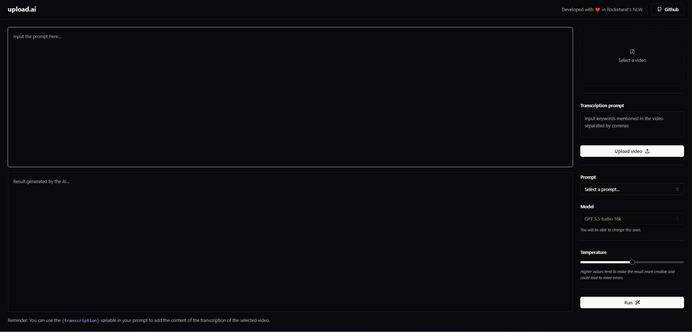

# UploadAI - AI-generated descriptions 🤖

<br>

<p align="center">
  <a href="#-about-the-project">About the project</a> •
  <a href="#-technologies">Technologies</a> •
  <a href="#-getting-started">Getting started</a> •
  <a href="#-license">License</a>
</p>

<p align="center">
 
  
</p>

## 👩‍💻 About the project

Upload.ai is an application that simplifies the creation of titles and descriptions for your videos. It allows you to upload videos, and with the ability for transcription through AI, it automatically generates engaging and highly indexable titles and descriptions for your videos, increasing the number of clicks.

This project is powered by a range of cutting-edge technologies, including the Vercel AI SDK, OpenAI, Shadcn/UI, Tailwind, and much more. Combining technological innovation with practicality to help you manage and optimize your audiovisual content effectively and efficiently.

## 🚀 Technologies

- [Axios](https://axios-http.com/ptbr/docs/intro)
- [Fastify](https://www.fastify.io/)
- [ffmpeg.wasm](https://github.com/ffmpegwasm/ffmpeg.wasm)
- [OpenAI](https://github.com/openai/openai-node)
- [Prisma](https://www.prisma.io/)
- [Radix-ui](https://www.radix-ui.com/)
- [Shadcn/ui](https://ui.shadcn.com/)
- [Tailwind CSS](https://tailwindcss.com/)
- [Vercel AI SDK](https://github.com/vercel/ai)
- [Vite.js](https://nextjs.org/)
- [Zod](https://github.com/colinhacks/zod)

## 💻 Getting started

### Requirements

- [Node.js](https://nodejs.org/en/)
- [Yarn](https://classic.yarnpkg.com/) or [NPM](https://www.npmjs.com/) _(examples are with NPM)_
- To run the project, you will need access to the OpenAI API. To set up your environment variables, please refer to this guide: [OpenAI](https://platform.openai.com/docs/quickstart)

**Clone the project and access the folder**

```bash
$ git clone https://github.com/leandrorodrigues00/upload-ai && cd upload-ai

```

**Follow the steps below to start the server**

```bash
# Install the dependencies
$ cd server
$ npm i

# Make a copy of '.env.example' to '.env'
# and set with YOUR environment variables.
$ cp .env.example .env

# Run database seeding
$ npx prisma db seed

# Start the app
$ npm run dev

# Your server will be available at the URL http://localhost:3333
```

**Follow the steps below to start the web application**

```bash
# Install the dependencies
$ cd upload-ai\web
$ npm i

# Start the app
$ npm run dev
```

## 📝 License

This project is licensed under the MIT License - see the [LICENSE](LICENSE) file for details.

---

<p align="center">
  Made with 💜&nbsp; by  Leandro Rodrigues during [Rocketseat's](https://rocketseat.com.br/) #Nlw-13
</p>
